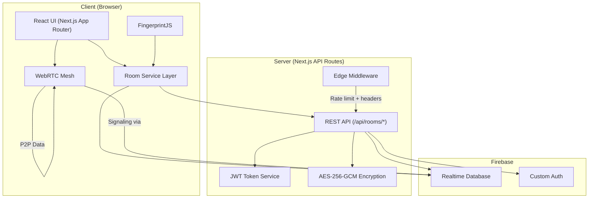
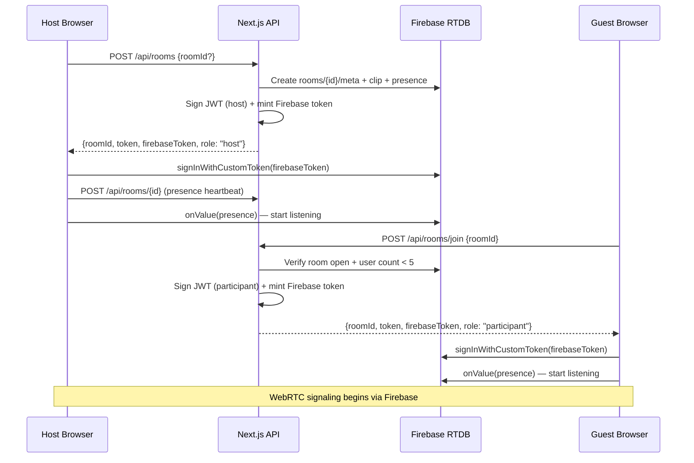

# ClipYard — Technical Documentation

---

## 1. Project Overview

**ClipYard** is a real-time, temporary clipboard web application that lets users instantly transfer text and files between devices (laptop, phone, desktop) without accounts, sign-ups, or app installations.

### What Problem It Solves

Moving text between personal devices (e.g., copying a URL from your phone to your laptop) typically requires email, messaging apps, or cloud sync accounts. ClipYard eliminates that friction with ephemeral, code-based rooms that self-destruct after use.

### Key Features

| Feature | Description |
|---|---|
| **Room-based sessions** | Create or join a room with an 8-character alphanumeric code |
| **Real-time text sync** | Shared clipboard that auto-saves and syncs across all devices in the room |
| **P2P file transfer** | Send files up to 50 MB directly between devices via WebRTC (no server upload) |
| **No accounts** | Username prompt per session — no sign-up, no passwords |
| **Device fingerprinting** | Semi-stable device identification for session continuity across refreshes |
| **Host role reclaim** | Room creator can reclaim host privileges after a page refresh |
| **Encryption at rest** | Clipboard text is AES-256-GCM encrypted in Firebase |
| **Light / Dark theme** | Persisted theme preference with system-preference fallback |
| **QR code joining** | Scan a QR code to join a room from a mobile device |
| **Rate limiting** | Sliding-window IP rate limiter on API endpoints |
| **OWASP security headers** | CSP, HSTS, X-Frame-Options, etc. applied via middleware |
| **SEO** | Full Open Graph, Twitter Cards, JSON-LD structured data, dynamic OG images |

---

## 2. Tech Stack

| Layer | Technology | Version |
|---|---|---|
| **Framework** | Next.js (App Router) | 16.3.0 |
| **Language** | TypeScript | 5.7.3 |
| **UI** | React | 19.x |
| **Styling** | Tailwind CSS v4 + vanilla CSS custom properties | 4.3.3 |
| **Realtime DB** | Firebase Realtime Database | 12.17.x (client) / 14.2.x (admin) |
| **Auth** | Firebase Custom Tokens + JWT (jose) | — |
| **P2P** | WebRTC (native browser API) | — |
| **Fingerprinting** | @fingerprintjs/fingerprintjs | 4.6.0 |
| **QR Codes** | qrcode.react | 4.2.0 |
| **Package Manager** | pnpm | 11.17.0 |
| **Deployment** | Vercel (inferred from `@vercel/analytics`) | — |

---

## 3. Project Structure

```
clipYard/
├── app/                          # Next.js App Router pages & API routes
│   ├── api/
│   │   ├── debug/                # Development/debug endpoints
│   │   │   ├── firebase-config/  # Firebase config verification
│   │   │   ├── room/             # Room debugging
│   │   │   └── signin-test/      # Auth testing
│   │   └── rooms/
│   │       ├── route.ts          # POST — create a new room
│   │       ├── join/
│   │       │   └── route.ts      # POST — join an existing room
│   │       └── [roomId]/
│   │           ├── route.ts      # GET/PATCH/POST/DELETE — room CRUD + presence
│   │           └── reclaim/
│   │               └── route.ts  # POST — host role reclaim
│   ├── og-image/                 # Dynamic OG image generation
│   ├── room/
│   │   └── [roomId]/
│   │       └── page.tsx          # Room page (client-side heavy)
│   ├── globals.css               # Design system tokens (--cy-*) + responsive helpers
│   ├── layout.tsx                # Root layout (fonts, theme, metadata)
│   ├── page.tsx                  # Home — server component (SEO + structured data)
│   ├── page.client.tsx           # Home — client component (hero, create/join UI)
│   ├── not-found.tsx             # 404 page
│   ├── robots.ts                 # robots.txt generation
│   └── sitemap.ts                # sitemap.xml generation
│
├── components/                   # Shared UI components
│   ├── ThemeProvider.tsx          # Light/dark theme context + toggle logic
│   ├── ThemeToggle.tsx            # Theme toggle button
│   └── ui/                       # Reusable UI primitives (shadcn-style)
│
├── hooks/                        # Global React hooks
│   └── useWebRTC.ts              # WebRTC mesh — peer connections + data channels
│
├── lib/                          # Core library modules
│   ├── clipboard.ts              # Room ID generation, validation, sanitization
│   ├── config.ts                 # Centralized env var access (public + server)
│   ├── firebase-admin.ts         # Server-side Firebase Admin SDK init
│   ├── firebase-client.ts        # Client-side Firebase SDK init
│   ├── presence.ts               # Presence lifespan constant (15s)
│   ├── room-data.ts              # AES-256-GCM encryption/decryption of clipboard text
│   ├── room-token.ts             # JWT signing/verification for room tokens
│   ├── utils.ts                  # General utilities (cn helper)
│   ├── seo/
│   │   ├── config.ts             # Site metadata, buildMetadata(), getRoomMetadata()
│   │   └── structured-data.ts    # JSON-LD structured data
│   └── webrtc/
│       ├── config.ts             # File transfer limits & chunk size
│       ├── dataChannel.ts        # RTCDataChannel creation & message handling
│       ├── db.ts                 # IndexedDB for received file storage
│       ├── fileTransfer.ts       # Chunked file send/receive protocol
│       ├── peerConnection.ts     # RTCPeerConnection factory
│       ├── signaling.ts          # Firebase-based SDP/ICE signaling
│       └── types.ts              # WebRTC type definitions
│
├── modules/                      # Feature modules (self-contained)
│   └── file-transfer/
│       ├── index.ts              # Barrel export
│       ├── components/
│       │   ├── FileSharePanel.tsx     # Main file sharing panel
│       │   ├── FileUploader.tsx       # Drag & drop / file picker
│       │   ├── FileTransferCard.tsx   # Active transfer card
│       │   ├── TransferProgress.tsx   # Progress bar + speed/ETA
│       │   ├── ReceivedFileCard.tsx   # Received file with preview
│       │   ├── FilePreview.tsx        # Image/video/doc preview
│       │   └── FileModal.tsx          # Full-screen file preview modal
│       └── hooks/
│           └── useFileTransfer.ts     # File transfer orchestration hook
│
├── services/                     # Client-side service layer
│   ├── room.ts                   # Room API calls, token cache, presence, username
│   └── fingerprint.ts            # FingerprintJS wrapper + local fallback
│
├── middleware.ts                 # Edge middleware: rate limiting + security headers
├── database.rules.json           # Firebase RTDB security rules
├── next.config.mjs               # Next.js configuration
├── tsconfig.json                 # TypeScript configuration
├── postcss.config.mjs            # PostCSS (Tailwind)
├── components.json               # shadcn/ui configuration
├── package.json                  # Dependencies & scripts
├── pnpm-workspace.yaml           # pnpm workspace config
└── public/                       # Static assets (icons, manifest, placeholders)
```

---

## 4. Installation & Setup

### Prerequisites

- **Node.js** ≥ 18.x
- **pnpm** 11.17.0 (`corepack enable && corepack prepare pnpm@11.17.0`)
- A **Firebase project** with:
  - Realtime Database enabled
  - Authentication enabled (custom token provider)
  - A service account key

### Step-by-Step Installation

```bash
# 1. Clone the repository
git clone https://github.com/mahesh2-lab/clipYard.git
cd clipYard

# 2. Install dependencies
pnpm install

# 3. Copy and configure environment variables
cp .env.example .env.local
# Edit .env.local with your Firebase credentials (see below)

# 4. Deploy Firebase Realtime Database rules
# Copy database.rules.json to your Firebase project's RTDB rules

# 5. Start development server
pnpm dev
```

### Environment Variable Configuration

| Variable | Required | Description |
|---|---|---|
| `NEXT_PUBLIC_SITE_URL` | Yes | Production URL (e.g., `https://clipyard.app`) |
| `NEXT_PUBLIC_SITE_NAME` | No | Site name (default: `ClipYard`) |
| `NEXT_PUBLIC_SITE_DESCRIPTION` | No | Meta description |
| `NEXT_PUBLIC_FIREBASE_API_KEY` | Yes | Firebase client API key |
| `NEXT_PUBLIC_FIREBASE_AUTH_DOMAIN` | Yes | Firebase auth domain |
| `NEXT_PUBLIC_FIREBASE_DATABASE_URL` | Yes | Firebase RTDB URL |
| `NEXT_PUBLIC_FIREBASE_PROJECT_ID` | Yes | Firebase project ID |
| `NEXT_PUBLIC_FIREBASE_STORAGE_BUCKET` | Yes | Firebase storage bucket |
| `NEXT_PUBLIC_FIREBASE_MESSAGING_SENDER_ID` | Yes | Firebase messaging sender ID |
| `NEXT_PUBLIC_FIREBASE_APP_ID` | Yes | Firebase app ID |
| `FIREBASE_PROJECT_ID` | Yes | Server-side Firebase project ID |
| `FIREBASE_CLIENT_EMAIL` | Yes | Service account email |
| `FIREBASE_PRIVATE_KEY` | Yes | Service account private key (PEM format) |
| `JWT_SECRET` | Yes | Secret for signing room JWT tokens |
| `ROOM_DATA_SECRET` | Yes | Secret for AES-256-GCM clipboard encryption |
| `GOOGLE_SITE_VERIFICATION` | No | Google Search Console verification |
| `BING_SITE_VERIFICATION` | No | Bing Webmaster verification |

---

## 5. Usage

### Running Locally

```bash
pnpm dev        # Start development server (http://localhost:3000)
pnpm build      # Production build
pnpm start      # Start production server
pnpm lint       # Run ESLint
```

### User Flow

1. **Create a room** → Click "Create Room" on the home page → An 8-character room code is generated
2. **Join a room** → Enter the room code or scan the QR code from another device
3. **Share text** → Type or paste text in the editor → It auto-syncs to all devices in the room
4. **Copy text** → Click "COPY CLIPBOARD" to copy the shared text to your device clipboard
5. **Send files** → Use the File Sharing panel to drag & drop files → They transfer P2P via WebRTC
6. **Leave** → Click the ClipYard logo or close the tab → Your presence is removed; the host can close the room entirely

---

## 6. Architecture

### High-Level Design



### Core Modules and Responsibilities

#### API Layer (`app/api/rooms/`)
- **`POST /api/rooms`** — Create a new room. Generates a room ID, creates the Firebase RTDB node, issues a JWT host token and a Firebase custom auth token.
- **`POST /api/rooms/join`** — Join an existing room as a participant. Validates the room is open and not full (max 5 users), issues participant tokens.
- **`GET /api/rooms/[roomId]`** — Fetch the full room snapshot (decrypted text, presence, devices). Requires a valid JWT.
- **`PATCH /api/rooms/[roomId]`** — Update the shared clipboard text (encrypted before storage).
- **`POST /api/rooms/[roomId]`** — Send a presence heartbeat with device metadata.
- **`DELETE /api/rooms/[roomId]`** — Leave room (participant) or close room (host with `x-close-room: 1` header).
- **`POST /api/rooms/[roomId]/reclaim`** — Allow a returning host to reclaim host privileges by matching their stored fingerprint.

#### Security (`middleware.ts`)
- **Rate limiting**: Sliding-window-log algorithm per IP. `/api/rooms/join` is limited to 10 req/min; `/api/rooms/*` to 400 req/min.
- **Security headers**: X-Frame-Options, X-Content-Type-Options, Referrer-Policy, Permissions-Policy, HSTS, CSP.

#### Data Encryption (`lib/room-data.ts`)
- Clipboard text is encrypted with **AES-256-GCM** before storage in Firebase and decrypted on read.
- The encryption key is derived from `ROOM_DATA_SECRET` via SHA-256.

#### Authentication (`lib/room-token.ts` + `lib/firebase-admin.ts`)
- Room access is controlled by **JWT tokens** (HS256, 24h expiry) containing `roomId`, `role`, and `sid`.
- Firebase custom auth tokens are minted server-side and used client-side for RTDB access.
- Firebase security rules enforce that users can only read/write within their assigned room.

#### Real-time Communication
- **Text sync**: Firebase RTDB listeners on `clip/updatedAt` trigger snapshot re-fetches.
- **Presence**: Client sends heartbeats every 5s via `POST /api/rooms/[roomId]`; Firebase RTDB `onValue` listener delivers real-time presence changes. Entries older than 15s are considered stale.
- **File transfer (WebRTC)**: Full P2P mesh via `RTCPeerConnection` + `RTCDataChannel`. Firebase RTDB acts as the signaling server for SDP offer/answer and ICE candidate exchange.

#### WebRTC File Transfer Protocol (`lib/webrtc/`)
1. **Signaling** — Firebase RTDB outbox pattern: each peer writes offers/answers/candidates to a path readable by the target peer.
2. **Peer mesh** — Deterministic initiator: the peer with the lexicographically greater UID creates the offer, preventing duplicate connections.
3. **Chunked transfer** — Files are split into 64 KB chunks. A JSON `file-start` header is sent first, followed by binary `file-chunk` messages, and a `file-complete` message to finalize.
4. **Categories** — Files are categorized as `image`, `video`, `document`, or `file` for preview purposes.

#### Client Services (`services/`)
- `room.ts` — Token caching (sessionStorage), host fingerprint persistence (localStorage), API call wrappers, Firebase subscription helpers, device label detection.
- `fingerprint.ts` — Lazy-loaded FingerprintJS singleton with a fast `localStorage`-based fallback.

### Data Flow: Creating and Joining a Room



---

## 7. API Reference

### `POST /api/rooms`
Create a new room.

| Field | Type | Description |
|---|---|---|
| `roomId` (optional) | string | Requested 8-char alphanumeric code. Auto-generated if omitted. |

**Response** `200`:
```json
{
  "roomId": "abc12xyz",
  "token": "<JWT>",
  "firebaseToken": "<Firebase custom token>",
  "role": "host"
}
```

**Errors**: `409` (room exists), `503` (Firebase not configured)

---

### `POST /api/rooms/join`
Join an existing room.

| Field | Type | Description |
|---|---|---|
| `roomId` | string | Room code to join |

**Response** `200`:
```json
{
  "roomId": "abc12xyz",
  "token": "<JWT>",
  "firebaseToken": "<Firebase custom token>",
  "role": "participant"
}
```

**Errors**: `400` (invalid room code), `403` (room full — max 5), `404` (room closed/missing), `503`

---

### `GET /api/rooms/[roomId]`
Fetch room snapshot. **Requires** `Authorization: Bearer <JWT>` or `?token=<JWT>`.

**Response** `200`:
```json
{
  "roomId": "abc12xyz",
  "status": "open",
  "text": "decrypted clipboard contents",
  "people": 2,
  "role": "host",
  "devices": [
    { "sid": "uuid", "fingerprint": "fp", "name": "Sarah", "deviceLabel": "Chrome on macOS", "role": "host" }
  ]
}
```

---

### `PATCH /api/rooms/[roomId]`
Update clipboard text. **Requires** JWT auth.

| Field | Type | Description |
|---|---|---|
| `text` | string | New clipboard contents (max 100,000 chars) |

**Response** `200`: `{ "ok": true }`

---

### `POST /api/rooms/[roomId]`
Send presence heartbeat. **Requires** JWT auth.

| Field | Type | Description |
|---|---|---|
| `name` | string | Display name (max 24 chars) |
| `deviceLabel` | string | e.g., "Chrome on Windows" |
| `instanceId` | string | Tab-unique ID for reload detection |

**Response** `200`: `{ "ok": true }`

---

### `DELETE /api/rooms/[roomId]`
Leave room or close it.

| Header | Value | Effect |
|---|---|---|
| (none) | — | Removes caller's presence entry |
| `x-close-room` | `1` | Host-only: deletes entire room |

**Response** `200`: `{ "ok": true }`

---

### `POST /api/rooms/[roomId]/reclaim`
Reclaim host role after page refresh. **Requires** JWT auth + `x-device-fingerprint` header matching the original host.

**Response** `200`: `{ "token": "<new host JWT>" }`
**Errors**: `403` (fingerprint mismatch)

---

### Authentication

All room API endpoints (except `POST /api/rooms` and `POST /api/rooms/join`) require a JWT token passed as:
- `Authorization: Bearer <token>` header, **or**
- `?token=<token>` query parameter

Tokens are **HS256 JWTs** with a 24-hour expiry containing:
```json
{ "roomId": "abc12xyz", "role": "host|participant", "sid": "uuid" }
```

---

## 8. Configuration

| File | Purpose |
|---|---|
| `next.config.mjs` | Next.js config: unoptimized images, server external packages for firebase-admin/jose |
| `tsconfig.json` | TypeScript config with `@/` path alias |
| `postcss.config.mjs` | PostCSS with `@tailwindcss/postcss` plugin |
| `components.json` | shadcn/ui component configuration |
| `database.rules.json` | Firebase RTDB security rules (see below) |
| `app/globals.css` | Design system: `--cy-*` CSS custom properties for light/dark themes |
| `lib/config.ts` | Centralized environment variable access with validation |

### Firebase Security Rules

The `database.rules.json` enforces:
- **Read**: Only authenticated users with a matching `roomId` claim can read room data
- **Write**: Presence entries are write-scoped to the authenticated user's UID
- **Signaling**: WebRTC signaling data is read/write scoped per-user within the room
- **Clip/Meta**: Write-protected (only the server/admin SDK can modify)

### Design Tokens

The theming system uses CSS custom properties (`--cy-*`) defined in `globals.css`:
- `html.light` — Light theme values
- `html.dark` — Dark theme values
- Tokens cover: background, surface, text, borders, primary, error, warning, shadows

---

## 9. Testing

### Testing Frameworks

Not specified — no test runner configuration or test files were found in the repository.

### Running Tests

```bash
pnpm lint    # ESLint only — no unit/integration test suite detected
```

> [!NOTE]
> Consider adding a testing framework (e.g., Vitest + React Testing Library) for unit and integration tests.

---

## 10. Contributing

Not specified — no `CONTRIBUTING.md` found in the repository. Recommended guidelines:

### Branching Strategy
- Feature branches: `feature-<description>`
- Bug fixes: `fix-<description>`
- Target branch for PRs: `main` (or feature-specific branches like `feature-video_Document_Transfer`)

### Code Standards
- TypeScript strict mode
- Tailwind CSS v4 for utility classes; `--cy-*` custom properties for theme tokens
- `'use client'` directive on all client-side modules
- `import 'server-only'` guard on server-only modules
- Centralized config access via `lib/config.ts`

---

## 11. Troubleshooting / FAQ

| Issue | Solution |
|---|---|
| **"Firebase is not configured" on room creation** | Ensure all `FIREBASE_*` and `NEXT_PUBLIC_FIREBASE_*` env vars are set in `.env.local` |
| **"Missing JWT_SECRET"** | Add `JWT_SECRET=<random-32-char-string>` to `.env.local` |
| **"Missing ROOM_DATA_SECRET"** | Add `ROOM_DATA_SECRET=<random-32-char-string>` to `.env.local` |
| **Rate limited (429)** | The sliding-window rate limiter caps `/api/rooms/join` at 10 req/min. Wait 60 seconds. |
| **Room shows "Offline" but devices are connected** | Check that Firebase RTDB URL is correct and accessible. Presence heartbeats fire every 5s; entries expire after 15s. |
| **File transfer fails** | WebRTC requires both devices to support `RTCPeerConnection`. Files are limited to 50 MB. Check browser console for ICE candidate errors. |
| **Theme doesn't persist** | Theme is stored in `localStorage` under key `clipyard-theme`. Ensure localStorage is available. |
| **Host loses host status after refresh** | The app automatically attempts host reclaim via fingerprint matching. If this fails, the fingerprint may have changed. |

---

## 12. License

Not specified — no `LICENSE` file found in the repository.
